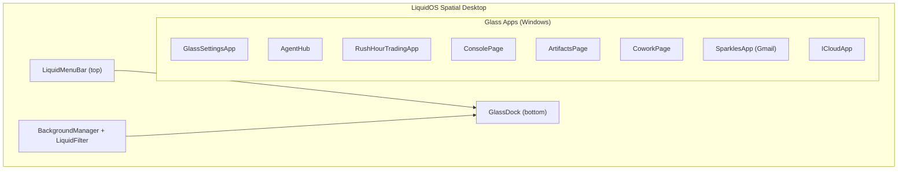

# LiquidOS Unified Architecture

> A comprehensive guide to LiquidOS's spatial desktop paradigm.

LiquidOS provides a **unified spatial desktop experience** where all applications, including trading tools, run as windowed Glass Apps within a single cohesive environment.

---

## Overview

| Component | Route Prefix | Description |
|-----------|-------------|-------------|
| **LiquidOS Desktop** | `/os/*` | Spatial desktop with dock, menu bar, and windowed apps |
| **Glass Apps** | Panel overlays | Trading, settings, agents, and other apps as windowed panels |



---

## Layout: LiquidOS Spatial Desktop

**File:** `src/layouts/LiquidOSLayout.tsx`

### Desktop Structure

```
┌────────────────────────────────────────────────────────┐
│  LiquidMenuBar (top)                                   │
│  [Logo] File  Edit  View  Go  ...   [Status Icons]     │
├────────────────────────────────────────────────────────┤
│                                                        │
│        SpatialCanvas (background)                      │
│        + BackgroundManager                             │
│        + LiquidFilter effects                          │
│                                                        │
│   ┌────────────────────────────────────────────┐       │
│   │     Page Content (via Router)              │       │
│   │     - AgentCommandCenter (home)            │       │
│   │     - GlassWindow overlays (apps)          │       │
│   └────────────────────────────────────────────┘       │
│                                                        │
├────────────────────────────────────────────────────────┤
│  GlassDock (bottom floating)                           │
│  [🏠] [⚙️] [👥] [📦] [💻] [🎨] [📁] [📈] [✉️] [☁️]   │
└────────────────────────────────────────────────────────┘
```

### Key Features

- **Windowed navigation** with GlassWindow panel overlays
- **GlassDock** (bottom) for app launching with icons
- **LiquidMenuBar** (top) for system menus with Many Worlds architecture
- **Keyboard shortcuts** (e.g., `Shift+Space` for dock, `⌘K` for command palette)

---

## Routes

All routes are under the `/os/*` prefix within the unified LiquidOS layout.

| Path | Component | Description |
|------|-----------|-------------|
| `/os` | Home | AgentCommandCenter |
| `/os/settings/*` | GlassSettingsApp | Settings panels |
| `/os/agents` | AgentHub | Agent management |
| `/os/console` | ConsolePage | Terminal/console |
| `/os/artifacts` | ArtifactsPage | Artifact viewer |
| `/os/cowork` | CoworkPage | Collaboration |
| `/os/showcase` | Showcase | Component library |
| `/os/design` | DesignGuide | Design system docs |
| `/os/demos/*` | 16 demo pages | Feature demos |
| `/os/docs/*` | Documentation | Various docs pages |

### Legacy Redirects

| Legacy Route | Redirects To |
|--------------|--------------|
| `/terminal/*` | `/os` |
| `/trading` | `/os` |
| `/settings` | `/os/settings` |
| `/design-guide` | `/os/design` |

---

## Desktop Elements

### GlassDock (Bottom Navigation)

- macOS-style floating dock with icon-based navigation
- Hover labels for accessibility
- Toggle with `Shift+Space`
- Opens Glass Apps as windowed panels:
  - `settings`, `cowork`, `agents`, `console`, `artifacts`
  - `showcase`, `finder`, `neonTokyo`, `auroraWeather`, `trading`
  - `sparkles` (Gmail client), `icloud` (Apple services)

### LiquidMenuBar (Top Navigation)

- Always-visible Apple-style menu bar
- Dynamic menu registration per app ("Many Worlds" architecture)
- Status icons on right side
- Privacy indicators: mic, camera, location, audio
- `⌘K` / `Ctrl+K` for command palette

### Panel/Window System

- **PortalFrame** for windowed overlays
- **GlassWindow** container component
- **desktopStore** manages panel state (activePanel, transitions)
- Overlay darkens background; dock hides when overlay is active

---

## Glass Apps

All major features are implemented as **Glass Apps** that open as windowed panels within LiquidOS:

| Glass App | Component | Description |
|-----------|-----------|-------------|
| **RushHour Trading** | `RushHourTradingApp` | Trading dashboard with chat interface |
| **Settings** | `GlassSettingsApp` | System preferences |
| **Agent Hub** | `AgentHub` | AI agent management |
| **Console** | `ConsolePage` | Terminal/console |
| **Artifacts** | `ArtifactsPage` | Artifact browser |
| **Cowork** | `CoworkPage` | Collaboration mode |
| **Sparkles** | `SparklesApp` | Gmail client with AI features |
| **iCloud** | `ICloudApp` | Apple iCloud services (Contacts, Calendar, Mail, Drive, Notes, Reminders, Photos, Find My) |

---

## State Management (Zustand)

| Store | Purpose |
|-------|---------|
| `desktopStore` | Panel navigation, activePanel, transitions |
| `themeStore` | Theme configuration |
| `settingsStore` | Application settings |
| `vaultStore` | Secure credential storage |
| `artifactStore` | Artifact management |
| `containerStore` | Container state |
| `coworkStore` | Collaboration state |
| `sandboxStore` | Sandbox environment |
| `skillStore` | Skills management |
| `sparklesStore` | Gmail client state |
| `icloudStore` | iCloud services state |

---

## Component Organization

```
src/components/
├── primitives/        (17 files)  - GlassButton, GlassLabel, GlassContainer
├── forms/             (46 files)  - Inputs, DatePicker, Upload, Select
├── layout/            (49 files)  - Navbar, Sidebar, Dock, Tabs, Accordion
├── feedback/          (12 files)  - Toast, Alert, Progress, Skeleton
├── data-display/      (82 files)  - Card, Table, Chart, Badge, Avatar
├── overlays/          (30 files)  - Modal, Drawer, Popover, CommandPalette
├── features/          (33 files)  - Chat, Editor, Kanban, Terminal, Trading
├── agentic/           (12 files)  - GlassAgent, GlassCopilot, GlassDynamicUI
├── trading/           (26 files)  - Trading-specific components
├── cowork/            (18 files)  - Collaboration components
├── console/           (11 files)  - Console/terminal components
├── agents/            (9 files)   - Agent management
├── generative/        (18 files)  - AI-generated UI
├── menu-bar/          (8 menus)   - Menu bar system
├── navigation/        (2 files)   - GlassBottomNav, GlassDock
├── Backgrounds/       (7 files)   - Background effects
└── Effects/                       - LiquidFilter SVG effects
```

---

## Glass Design System

Apple HIG-inspired glassmorphism with theme-aware styling:

| Mode | Glass Type | Text Color |
|------|-----------|------------|
| Dark | Tinted glass | White text |
| Light | Frosted glass | Dark text |
| Tinted | Higher contrast | Accessibility mode |

### CSS Variables

```css
/* Glass Backgrounds */
--glass-bg-thin
--glass-bg-regular
--glass-bg-thick
--glass-bg-clear

/* Borders & Effects */
--glass-border
--glass-shadow
--glass-highlight

/* Text Hierarchy */
--label-primary
--label-secondary
--label-tertiary
--label-quaternary
```

---

## Key Files Reference

| File | Size | Purpose |
|------|------|---------|
| `Router.tsx` | ~12kb | All route definitions |
| `LiquidOSLayout.tsx` | ~15kb | Desktop spatial layout |
| `RushHourTradingApp.tsx` | ~8kb | Trading Glass App |
| `GlassDock.tsx` | ~6kb | Bottom dock navigation |
| `LiquidMenuBar.tsx` | ~4kb | Top menu bar |
| `DesignGuide.tsx` | ~51kb | Design system showcase |
| `index.css` | ~37kb | Global styles |
| `desktopStore.ts` | ~4kb | Desktop panel state |
| `themePresetsSlice.ts` | ~16kb | Theme presets |

---

## Keyboard Shortcuts

| Shortcut | Action |
|----------|--------|
| `Shift+Space` | Toggle GlassDock |
| `⌘K` / `Ctrl+K` | Open Command Palette |

---

## Summary

The LiquidOS Unified Architecture provides:

- **390+ components** in a unified spatial desktop
- **Glass Apps** as windowed panels for all major features
- **Trading integrated** as RushHourTradingApp Glass App
- **Comprehensive state management** via Zustand stores
- **Apple HIG-inspired** glassmorphism design system
- **Single layout** (`LiquidOSLayout`) for all routes
