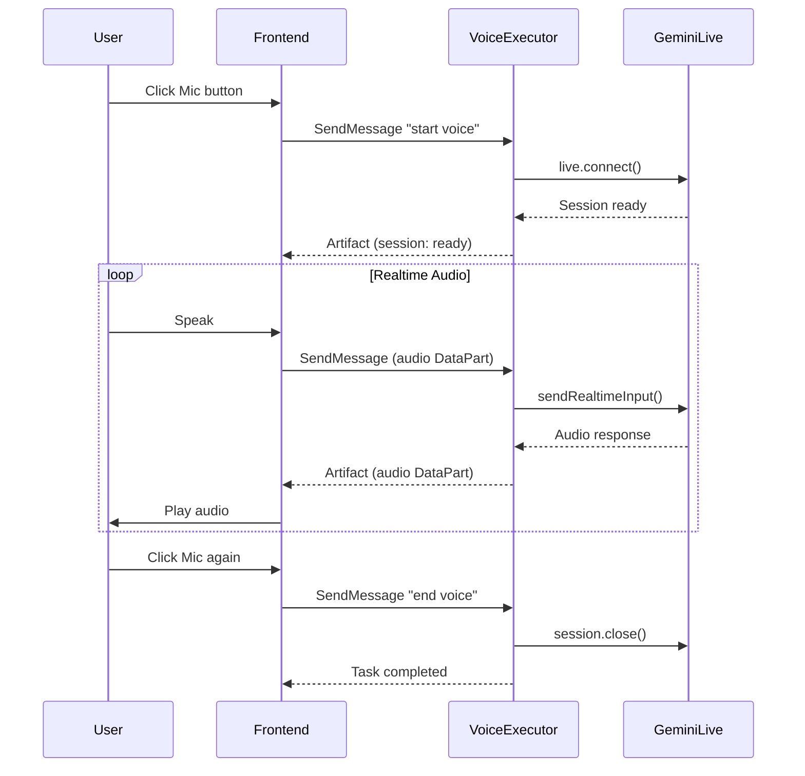

# Voice Integration

Realtime voice conversations with agents using Google Gemini Live API via A2A protocol.

## Overview

The voice system enables bidirectional audio streaming between users and agents. Audio is captured from the microphone, streamed to the backend via A2A DataParts, processed by Gemini Live API, and responses are streamed back as audio artifacts.



## Architecture

### Backend Components

| Component | Location | Purpose |
|-----------|----------|---------|
| VoiceExecutor | `server/src/a2a/executors/voice.ts` | Gemini Live session management |
| RouterExecutor | `server/src/a2a/executors/router.ts` | Routes to voice executor |
| A2A Plugin | `server/src/a2a/elysia-plugin.ts` | JSON-RPC/SSE endpoints |

### Frontend Components

| Component | Location | Purpose |
|-----------|----------|---------|
| useA2AVoice | `src/hooks/useA2AVoice.ts` | Voice session hook |
| GlassPrompt | `src/components/agentic/GlassPrompt.tsx` | Mic button integration |
| AgentChatWindow | `src/components/agents/AgentChatWindow.tsx` | Agent chat integration |

## Configuration

### Environment Variables

```bash
# server/.env
GEMINI_API_KEY=your-api-key-here
```

### Voice Model

The default model is `gemini-2.5-flash-preview-native-audio-dialog`. Available voices:
- `Puck` (default)
- `Aoede`
- `Charon`
- `Fenrir`
- `Kore`

## Usage

### Frontend Hook

```typescript
import { useA2AVoice } from '@/hooks/useA2AVoice';

function MyComponent() {
  const voice = useA2AVoice({
    contextId: 'session-123',
    onTranscript: (text) => console.log('Transcript:', text),
    onStateChange: (state) => console.log('State:', state),
  });

  return (
    <button onClick={() => voice.isActive ? voice.stop() : voice.start()}>
      {voice.isActive ? 'Stop' : 'Start'} Voice
    </button>
  );
}
```

### Voice States

| State | Description | Visual |
|-------|-------------|--------|
| `idle` | No active session | Default mic icon |
| `connecting` | Establishing connection | Blue, spinner |
| `listening` | Mic active, receiving audio | Red, pulsing |
| `speaking` | Playing AI response | Amber, waveform |
| `error` | Session error | Red, error icon |

## A2A Protocol

### Start Voice Session

```json
{
  "jsonrpc": "2.0",
  "id": "uuid",
  "method": "SendMessage",
  "params": {
    "message": {
      "messageId": "uuid",
      "role": "user",
      "contextId": "session-123",
      "parts": [{ "text": "start voice with Puck" }]
    },
    "metadata": {
      "targetAgent": "voice",
      "agentId": "my-agent",
      "systemPrompt": "You are a helpful assistant."
    }
  }
}
```

### Send Audio Data

```json
{
  "jsonrpc": "2.0",
  "id": "uuid",
  "method": "SendMessage",
  "params": {
    "message": {
      "messageId": "uuid",
      "role": "user",
      "contextId": "session-123",
      "parts": [{
        "data": {
          "data": {
            "mimeType": "audio/pcm;rate=16000",
            "data": "base64-encoded-pcm-audio"
          }
        }
      }]
    },
    "metadata": { "targetAgent": "voice" }
  }
}
```

### End Voice Session

```json
{
  "jsonrpc": "2.0",
  "id": "uuid",
  "method": "SendMessage",
  "params": {
    "message": {
      "messageId": "uuid",
      "role": "user",
      "contextId": "session-123",
      "parts": [{ "text": "end voice" }]
    },
    "metadata": { "targetAgent": "voice" }
  }
}
```

## Visual Assets

Voice orb images are located in `public/images/voice/`:
- `voice_orb_idle_*.png` - Iridescent glass orb
- `voice_orb_listening_*.png` - Red pulsing orb with sound waves
- `voice_orb_speaking_*.png` - Amber orb with waveform

## Troubleshooting

### Common Issues

| Issue | Cause | Solution |
|-------|-------|----------|
| "GEMINI_API_KEY not configured" | Missing env var | Add to `server/.env` |
| Mic permission denied | Browser blocked | Check browser permissions |
| No audio response | Network/SSE issue | Check SSE connection |
| Audio quality poor | Sample rate mismatch | Ensure 16kHz PCM |

### Debug Logging

Enable verbose logging:
```typescript
// VoiceExecutor logs prefixed with [VoiceExecutor]
// useA2AVoice logs prefixed with [useA2AVoice]
```
