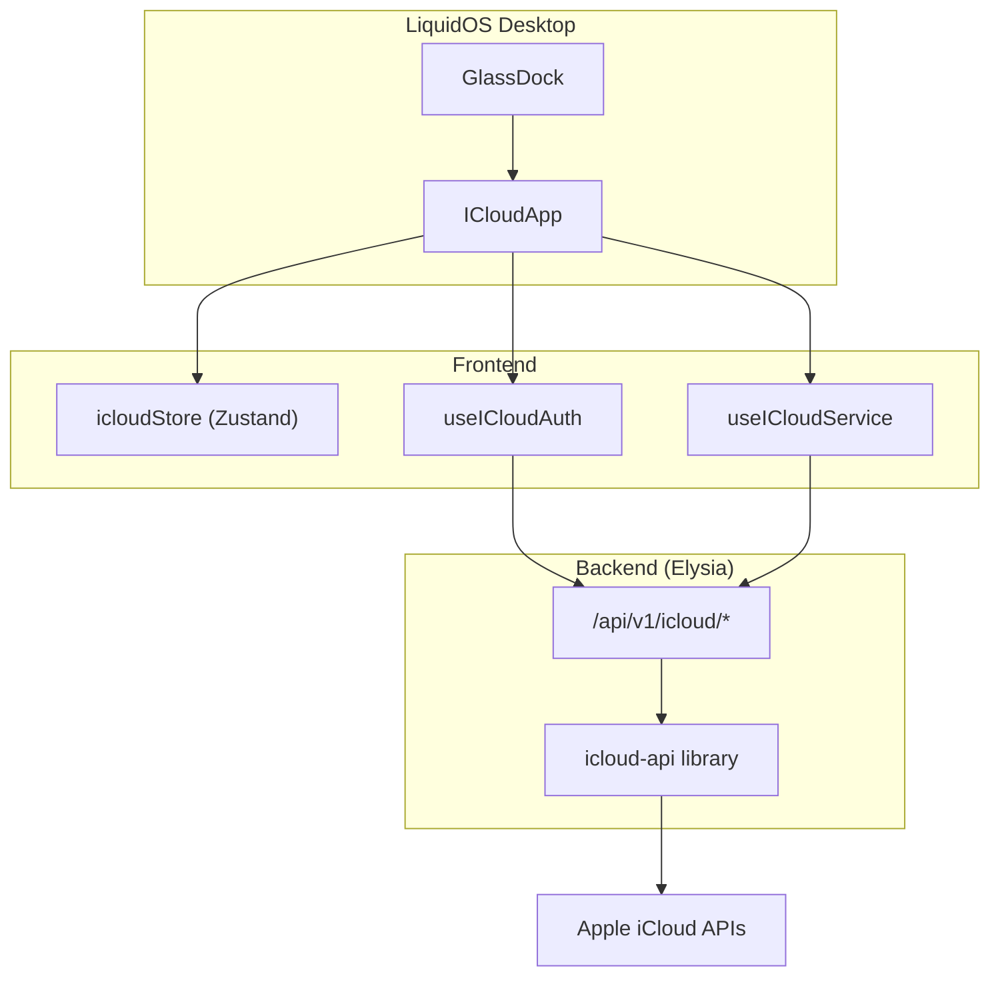

# iCloud GlassApp Integration

> A native LiquidOS GlassApp for Apple iCloud services.

## Overview

The iCloud GlassApp provides access to Apple iCloud services directly within LiquidOS. It was migrated from a standalone Express/React application into a fully integrated Glass App.

## Features

| Service | Description |
|---------|-------------|
| **Contacts** | View, create, update, and delete contacts |
| **Calendar** | Manage calendars and events |
| **Mail** | Access folders, read messages, send mail |
| **Drive** | Browse files and folders |
| **Notes** | Create and manage notes |
| **Reminders** | Task management |
| **Photos** | View albums and photos |
| **Find My** | Device tracking and actions |

## Architecture



## Files

### Frontend

| File | Purpose |
|------|---------|
| `src/stores/icloudStore.ts` | Zustand state management |
| `src/hooks/useICloudAuth.ts` | Authentication operations |
| `src/hooks/useICloudService.ts` | Service data operations |
| `src/components/features/icloud/ICloudApp.tsx` | Main app component |

### Backend

| File | Purpose |
|------|---------|
| `server/src/routes/icloud.ts` | Elysia API routes |

## API Endpoints

All endpoints are prefixed with `/api/v1/icloud`.

### Authentication

| Method | Endpoint | Description |
|--------|----------|-------------|
| `POST` | `/auth/login` | Authenticate with Apple ID |
| `POST` | `/auth/verify-2fa` | Submit 2FA code |
| `POST` | `/auth/logout` | End session |
| `GET` | `/auth/status` | Check session status |

### Services

| Service | Endpoints |
|---------|-----------|
| Contacts | `GET /contacts`, `POST /contacts`, `PUT /contacts/:id`, `DELETE /contacts/:id` |
| Calendar | `GET /calendars`, `GET /calendars/:id/events`, `POST /events`, `PUT /events/:id` |
| Mail | `GET /mail/folders`, `GET /mail/messages`, `POST /mail/send` |
| Drive | `GET /drive`, `GET /drive/folder/:id` |
| Notes | `GET /notes`, `GET /notes/:id`, `POST /notes`, `DELETE /notes/:id` |
| Reminders | `GET /reminders`, `POST /reminders`, `PUT /reminders/:id/complete` |
| Photos | `GET /photos`, `GET /photos/albums` |
| Find My | `GET /findmy/devices`, `POST /findmy/devices/:id/sound` |

## Usage

### Opening the App

Click the iCloud icon (cloud with cog) in the GlassDock, or use keyboard navigation.

### Demo Mode

For showcasing without credentials:
1. Open the iCloud app
2. Click "Try Demo Mode"
3. Navigate through services with sample data

### Authentication Flow

1. Enter Apple ID and password
2. If 2FA is enabled, enter the 6-digit code
3. Session is maintained until logout

## State Management

The `icloudStore` manages:

```typescript
interface ICloudState {
  // Auth
  isAuthenticated: boolean;
  sessionId: string | null;
  user: ICloudUser | null;
  requires2FA: boolean;
  demoMode: boolean;
  
  // Service data
  contacts: Contact[];
  calendars: Calendar[];
  events: CalendarEvent[];
  mailFolders: MailFolder[];
  messages: MailMessage[];
  driveItems: DriveItem[];
  notes: Note[];
  reminders: Reminder[];
  albums: PhotoAlbum[];
  photos: Photo[];
  devices: FindMyDevice[];
  
  // Loading states
  loading: Record<string, boolean>;
}
```

## Migration History

The iCloud app was migrated from a standalone project in January 2026:

- **Phase 1**: Backend routes consolidated into Elysia
- **Phase 2**: Frontend migrated to Zustand store + hooks
- **Phase 3**: Integrated into LiquidOS dock and window system
- **Phase 4**: Cleanup of standalone files

Original documentation is archived at `docs/archived/icloud-standalone/`.
