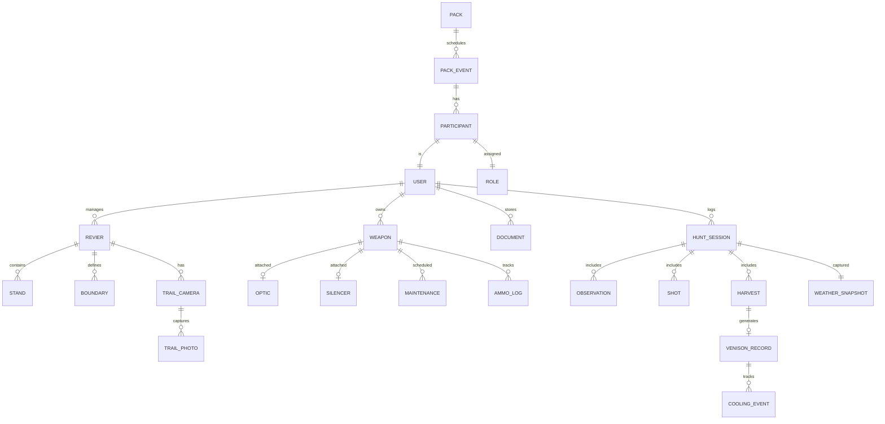

# Jagd-Agenten — Complete Feature Implementation Plan

> **Goal:** Implement the full Jagd-Agenten v2 concept as the ultimate AI-powered hunting companion for DACH hunters.

---

## Current Status: 55% Complete → v2 Vision

| Phase | Status | Description |
|-------|--------|-------------|
| ✅ Phase 1-6 | **Complete** | Core MVP features implemented |
| 🔄 Phase A-F | **In Progress** | v2 enhancements for differentiation |

---

## Implemented Features (v1 Complete)

### Scout Agent ✅
- [x] Cockpit Dashboard (`DailyCockpit.tsx`)
- [x] Smart Maps with pigeon-maps (`HuntingMap.tsx`)
- [x] Weather API integration (`weather-service.ts`)
- [x] Huntability Score (0-100)
- [x] Büchsenlicht Countdown
- [x] Scent Cone Visualization (`ScentConeOverlay`)
- [x] Harvest Heatmap (`HeatmapLayer.tsx`)
- [x] Cadastral Boundaries (`CadastralLayer.tsx`)

### Bureaucracy Agent ✅
- [x] Streckenliste Generator for all 16 Bundesländer
- [x] Document Vault with encrypted storage
- [x] Expiration Alerts (30/14/7/1 days)
- [x] Guest Permit QR Generator
- [x] Export Pack Generator

### Quartermaster Agent ✅
- [x] Digital Gun Safe (`EquipmentInventory.tsx`)
- [x] Ammo Tracker
- [x] Maintenance Scheduler
- [x] Trail Camera Integration (`TrailCameraFeed.tsx`)

### Journal Agent ✅
- [x] Session Logging (`JournalView.tsx`)
- [x] Hunt Timeline (`HuntTimeline.tsx`)
- [x] Venison QR Codes with Cooling Chain (`VenisonQRCode.tsx`)

### Pack Agent ✅
- [x] Live Tracking (`LiveTrackingView.tsx`)
- [x] Emergency Beacon (`EmergencyBeacon.ts`)
- [x] Event Calendar (`HuntingCalendar.tsx`)

### UX Polish ✅
- [x] Dark Mode (system theme)
- [x] Red Light Mode (`useRedLightMode.ts`)
- [x] Offline-First Architecture (`sw.ts`, `offlineStore.ts`)

---

## Remaining v2 Features (~40 hours)

### Phase A: Hunt Session Mode 🎯 (8 hrs)

The core differentiator: "Start Hunt → End Hunt" flow.

| Feature | File | Description |
|---------|------|-------------|
| **Session Data Model** | `types/HuntSession.ts` | Ansitz/Pirsch/Drückjagd types |
| **Session Store** | `useHuntSessionStore.ts` | State management |
| **Hunt Mode UI** | `HuntModeView.tsx` | Full-screen hunt interface |
| **Start Hunt Modal** | `StartHuntModal.tsx` | Session start flow |
| **End Hunt Summary** | `EndHuntSummary.tsx` | Post-hunt summary + prompts |
| **Personalized Greeting** | `DailyCockpit.tsx` | "Guten Abend, Mario..." |

---

### Phase B: Scout Intelligence 🧠 (10 hrs)

AI-powered recommendations.

| Feature | File | Description |
|---------|------|-------------|
| **Stand Recommendations** | `stand-recommender.ts` | AI suggests best stand |
| **Approach Suggestions** | `stand-recommender.ts` | Optimal route calculation |
| **GPX/KML Import** | `BoundaryImport.tsx` | Import boundary files |
| **Distance Rings** | `HuntingMap.tsx` | 100/200/300m overlays |
| **Quiet Zones** | `HuntingMap.tsx` | Mark undisturbed areas |
| **Danger Cones** | `HuntingMap.tsx` | Roads/houses no-shoot zones |

---

### Phase C: Drückjagd Support 🦌 (6 hrs)

Driven hunt features.

| Feature | File | Description |
|---------|------|-------------|
| **Drückjagd Pack** | `DrueckjagdPackGenerator.tsx` | Printable stand cards, lists |
| **Role Tags** | `HuntingCalendar.tsx` | Stand/Treiber/Hundeführer |
| **No-Go Zone Overlays** | `LiveTrackingView.tsx` | Shooting direction limits |
| **Auto Check-In** | `jagd-pack.ts` | Geofence/code check-in |

---

### Phase D: Privacy & Trust 🔒 (5 hrs)

German data protection expectations.

| Feature | File | Description |
|---------|------|-------------|
| **Local-Only Mode** | `offlineStore.ts` | Never sync option |
| **E2E Encryption** | `DocumentVault.tsx` | Client-side encryption |
| **Granular Location** | `useHuntSessionStore.ts` | Exact/blurred/none |
| **Privacy Messaging** | `PrivacyBanner.tsx` | Trust-building UI |

---

### Phase E: Tooltips & Help 💡 (3 hrs)

Contextual help throughout.

| Component | Tooltip Content |
|-----------|-----------------|
| Huntability Score | "Jagdbarkeitswert basierend auf Wind, Niederschlag, Mondphase" |
| Büchsenlicht | "Gesetzliche Schießzeit basierend auf bürgerlicher Dämmerung" |
| Scent Cone | "Windbasierter Witterungskorridor" |
| Cooling Chain | "EU-Lebensmittelsicherheit (Verordnung 178/2002)" |
| Emergency Beacon | "SMS an Notfallkontakte bei 30min Inaktivität" |

---

### Phase F: Proactive Notifications 🔔 (8 hrs)

"A team that nudges you."

| Feature | File | Description |
|---------|------|-------------|
| **Notification System** | `NotificationService.ts` | Central push manager |
| **Wind Shift Alerts** | `weather-service.ts` | Forecast comparison |
| **Zero-Check Reminder** | `maintenance-scheduler.ts` | Before-hunt prompt |
| **Post-Hunt Prompts** | `EndHuntSummary.tsx` | Smart suggestions |
| **Quiet Season Mode** | Settings | Notification suppression |

---

## API Endpoints (Complete)

### Implemented
| Endpoint | Method | Purpose |
|----------|--------|---------|
| `/api/v1/jagd/cockpit/briefing` | GET | Morning dashboard |
| `/api/v1/jagd/scout/weather` | GET | Weather data |
| `/api/v1/jagd/scout/conditions` | GET | Full conditions |
| `/api/v1/jagd/bureaucracy/*` | CRUD | Documents, alerts |
| `/api/v1/jagd/quartermaster/*` | CRUD | Equipment, ammo |
| `/api/v1/jagd/journal/*` | CRUD | Sessions, entries |
| `/api/v1/jagd/pack/*` | CRUD | Events, tracking |
| `/api/v1/jagd/streckenliste/*` | POST/GET | Report generation |
| `/api/v1/jagd/venison/*` | CRUD | Wildbret tracking |
| `/api/v1/jagd/trailcam/*` | CRUD | Camera photos |

### Planned (v2)
| Endpoint | Method | Purpose |
|----------|--------|---------|
| `/api/v1/jagd/session/*` | CRUD | Hunt sessions |
| `/api/v1/jagd/scout/recommend` | GET | Stand recommendations |
| `/api/v1/jagd/import/boundary` | POST | GPX/KML import |
| `/api/v1/jagd/drueckjagd/*` | CRUD | Driven hunt packs |

---

## Data Model



---

## External Integrations

| Service | Purpose | Status |
|---------|---------|--------|
| OpenWeatherMap | Weather data | ✅ Implemented |
| SunCalc | Büchsenlicht | ✅ Implemented |
| Web Crypto API | E2E Encryption | 🔄 Planned |
| Web Push API | Notifications | 🔄 Planned |
| SPYPOINT API | Trail cameras | ✅ Webhook ready |
| Twilio | Emergency SMS | ✅ Implemented |

---

## File Structure

```
src/applications/jagd-agenten/
├── App.tsx
├── components/
│   ├── ActionChips.tsx
│   ├── AgentBadge.tsx
│   ├── BuechsenlichtCountdown.tsx
│   ├── CadastralLayer.tsx
│   ├── ChatView.tsx
│   ├── DailyCockpit.tsx
│   ├── DocumentVault.tsx
│   ├── EquipmentInventory.tsx
│   ├── ExpirationAlerts.tsx
│   ├── GuestPermitQRCode.tsx
│   ├── HeatmapLayer.tsx
│   ├── HuntingCalendar.tsx
│   ├── HuntingMap.tsx
│   ├── JournalView.tsx
│   ├── LiveTrackingView.tsx
│   ├── PackDashboard.tsx
│   ├── RedLightToggle.tsx
│   ├── StreckenlisteGenerator.tsx
│   ├── TrailCameraFeed.tsx
│   ├── VenisonQRCode.tsx
│   └── [v2]
│       ├── BoundaryImport.tsx
│       ├── DrueckjagdPackGenerator.tsx
│       ├── EndHuntSummary.tsx
│       ├── HuntModeView.tsx
│       ├── PrivacyBanner.tsx
│       ├── StartHuntModal.tsx
│       └── Tooltip.tsx
├── hooks/
│   ├── useRedLightMode.ts
│   └── [v2]
│       └── useHuntSession.ts
├── services/
│   ├── EmergencyBeacon.ts
│   └── [v2]
│       └── NotificationService.ts
├── stores/
│   └── [v2]
│       └── useHuntSessionStore.ts
├── types/
│   └── [v2]
│       └── HuntSession.ts
└── utils/
    └── registerServiceWorker.ts

server/src/
├── routes/
│   ├── jagd-admin.ts
│   ├── jagd-bureaucracy.ts
│   ├── jagd-chat.ts
│   ├── jagd-cockpit.ts
│   ├── jagd-journal.ts
│   ├── jagd-pack.ts
│   ├── jagd-quartermaster.ts
│   ├── jagd-scout.ts
│   ├── jagd-streckenliste.ts
│   ├── jagd-trailcam.ts
│   ├── jagd-venison.ts
│   └── [v2]
│       ├── jagd-drueckjagd.ts
│       ├── jagd-import.ts
│       └── jagd-session.ts
└── services/
    ├── expiration-monitor.ts
    ├── maintenance-scheduler.ts
    ├── proactive-advice.ts
    ├── weather-service.ts
    └── [v2]
        └── stand-recommender.ts
```

---

## Success Metrics

| Metric | Target |
|--------|--------|
| v2 Feature Completion | 100% in 40 hrs |
| TypeScript Errors | 0 |
| Daily Active Users | 1,000 in 6 months |
| Session Logs / Week | 5 per active user |
| Premium Conversion | 15% of active users |
| App Store Rating | 4.5+ stars |
| Crash-Free Sessions | 99.5% |

---

## Signature Moments (v2)

These are the "wow" moments that differentiate Jagd-Agenten:

1. **"Guten Abend, Mario: Wind stabil aus NW bis 20:15 — Eiche Nord ist optimal."**
2. **"Ansitz beendet. Streckenmeldung für Landkreis Celle erstellen?"**
3. **"Wildbret Pass erstellt. QR-Etikett bereit. Kühlketten-Timer läuft."**
4. **"Windwechsel um 18:40 vorhergesagt — Stand wechseln?"**
5. **"Letzte Einschießkontrolle vor 92 Tagen. Vor dem Ansitz prüfen?"**
